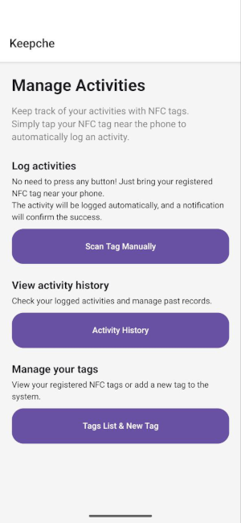
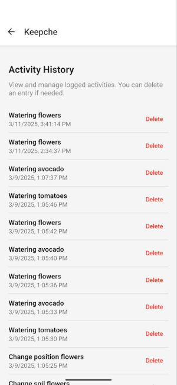
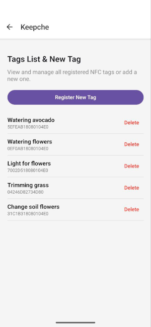

# Overview

Keepche is a React Native application that allows users to log activities automatically using NFC tags. Users can register NFC tags with custom names, and whenever a tag is scanned, an activity is automatically logged and stored.

# Features

* Automatic NFC Scanning – Logs activities when an NFC tag is tapped.
* Manual Scanning – Users can manually trigger NFC scanning from the home screen.
* Activity History – View previously logged activities.
* Tag Management – Register new NFC tags and manage them in a dedicated list.
* Background Processing – The app sends a notification when an activity is logged, even if the app is in the background.

# Usage Guide
### 1. Register a New NFC Tag
1. Navigate to the **"Tags List & New Tag"** section.
2. Tap **"Register a New NFC Tag"** and scan an NFC tag.
3. Assign a unique name to the tag.
4. The tag is now saved in the database and ready to use.

### 2. Log an Activity with NFC
- **Simply tap an NFC tag near your phone.**
- The app will detect the tag and **automatically log an activity**.
- A **notification** will confirm that the activity was logged.

### 3. View Activity History
- Open the **"Activity History"** section.
- See all previously **logged activities with timestamps**.
- Activities are stored in Firebase Firestore.

### 4. Manually Scan an NFC Tag
- Tap **"Scan Activity Manually"** on the home screen.
- This will start the NFC scanning process.
- If you tap the button again while scanning, the process will **cancel**.

# Technologies
 
- **React Native** – UI framework for mobile development
- **TypeScript** – Strongly-typed JavaScript
- **Firebase Firestore** – Cloud database for storing logs and tags
- **React Navigation** – Navigation handling between screens
- **Notifee** – Push notifications for activity confirmation
- **react-native-nfc-manager** – NFC scanning and writing library
- **React Native Paper** – UI components and styling
- **Android Application Record (AAR)** – Ensures automatic app launch when scanning NFC tags

# Screenshots





# How to run this app

Based on the [**React Native**](https://reactnative.dev) project, bootstrapped using [`@react-native-community/cli`](https://github.com/react-native-community/cli).

> **Note**: Make sure you have completed the [Set Up Your Environment](https://reactnative.dev/docs/set-up-your-environment) guide before proceeding.

## Step 1: Start Metro

First, you will need to run **Metro**, the JavaScript build tool for React Native.

To start the Metro dev server, run the following command from the root of your React Native project:

```sh
# Using npm
npm start

# OR using Yarn
yarn start
```

## Step 2: Build and run your app

With Metro running, open a new terminal window/pane from the root of your React Native project, and use one of the following commands to build and run your Android or iOS app:

### Android

```sh
# Using npm
npm run android

# OR using Yarn
yarn android
```

### iOS

For iOS, remember to install CocoaPods dependencies (this only needs to be run on first clone or after updating native deps).

The first time you create a new project, run the Ruby bundler to install CocoaPods itself:

```sh
bundle install
```

Then, and every time you update your native dependencies, run:

```sh
bundle exec pod install
```

For more information, please visit [CocoaPods Getting Started guide](https://guides.cocoapods.org/using/getting-started.html).

```sh
# Using npm
npm run ios

# OR using Yarn
yarn ios
```

If everything is set up correctly, you should see your new app running in the Android Emulator, iOS Simulator, or your connected device.

This is one way to run your app — you can also build it directly from Android Studio or Xcode.
